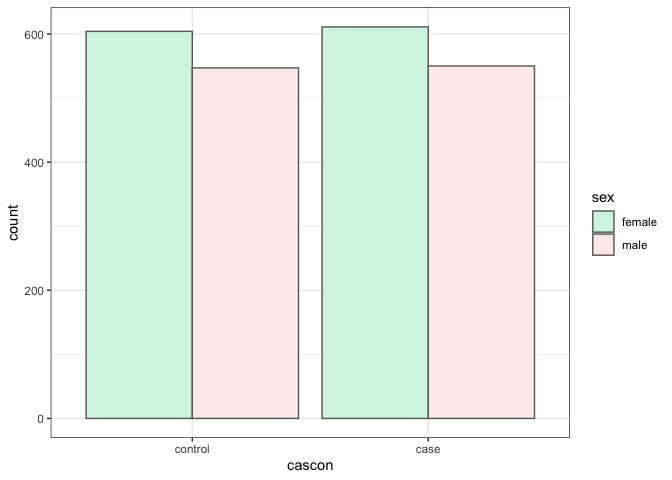

***

# Question nº 1

To read the files in plink format, the **read.plink()** function of the **snpStats** library has been used. In the output list obtained named **colorectal_data**, the "genotypes" object refers to the .bed file; the "fam" object refers to the .fam file; and the "map" object refers to the .bim file.

To be able to work better with these objects, each one has been saved in a different data frame: **colorectal.map, colorectal.fam**. And the case of the "genotypes" object in the variable **colorectal.geno** which is an element of the SnpMatrix class.

To determine that there are 2312 individuals and 100000 SNPs in the sample, the **dim()** function of the R base package has been used to see the size of the different files.


```r
#LIBRARIES
library(snpStats)
library(data.table)
library(ggplot2)

#PLINK FILES
path = "/Volumes/TOSHIBA EXT/3r curs/2n quatri/Bioinformàtica II/R/EXERCICI_AV/"
colorectal_data <- read.plink(paste0(path,"colorectal"))

colorectal.map <- colorectal_data$map
colorectal.geno <- colorectal_data$genotypes
colorectal.fam <- colorectal_data$fam

dim(colorectal.map) # [1] 100000      6
```

```
## [1] 100000      6
```

```r
#INDIVIDUALS IN THE SAMPLE
dim (colorectal.fam) # [1] 2312    6
```

```
## [1] 2312    6
```

```r
# SNPs IN THE SAMPEL
dim(colorectal.geno) # [1]   2312 100000
```

```
## [1]   2312 100000
```

# Question nº 2

The covariable file is saved in the form of a data frame with the name **colorectal_covs** using the **fread()** function of the **data.table** library. Data frame variables that are categorical are also passed to factors with the **factor()** and **as.factor()** functions.


```r
#COVALIABLE FILE
colorectal_covs <- data.frame(fread(paste0(path, "colorectal.txt")))
colorectal_covs$cascon <- factor(colorectal_covs$cascon, levels = c(0, 1), labels = c('control', 'case'))
colorectal_covs$sex <- as.factor(colorectal_covs$sex)
colorectal_covs$smoke <- as.factor(colorectal_covs$smoke)
```

## Question nº 2.1 

In the file **colorectal_covs** we can find the following variables of 2312 individuals: id, cascon, sex, age, smoke, bmi. A descriptive analysis of all of them has been done using the **summary()** function of the R base package.

To find the percentages of the different covariables, the **table()** function has been used within the **prop.table()** function within the **round()** function. What this returns is a table with the proportions for each category of the variable on the total, and by multiplying it by 100 we get the percentage.

Within the sample of patients, 53% are women and 47% men.
There are 50% controls and 50% cases.
And 40% are smokers, 20% are ex-smokers, and 20% of the sample has never smoked.
As for the ages of the individuals, they range from 29 to 55 years, and the average is 41.79888 years.


```r
#DESCRIPTIVE ANALYSIS
summary(colorectal_covs [,-1]) 
```

```
##      cascon         sex            age           smoke           bmi      
##  control:1151   female:1215   Min.   :29.0          :   5   Min.   :18.0  
##  case   :1161   male  :1097   1st Qu.:36.0   Current:1022   1st Qu.:24.0  
##                               Median :42.0   Ex     : 467   Median :26.0  
##                               Mean   :41.8   Never  : 818   Mean   :27.1  
##                               3rd Qu.:48.0                  3rd Qu.:29.0  
##                               Max.   :55.0                  Max.   :55.0  
##                                                             NA's   :108
```

```r
round(prop.table(table(colorectal_covs$sex)),2)*100  # f = 53%; m = 47%
```

```
## 
## female   male 
##     53     47
```

```r
round(prop.table(table(colorectal_covs$cascon)),2)*100 # control = case = 50%
```

```
## 
## control    case 
##      50      50
```

```r
round(prop.table(table(colorectal_covs$smoke)),1)*100 # Current = 40%; Ex = 20%; Never = 40%
```

```
## 
##         Current      Ex   Never 
##       0      40      20      40
```

```r
mean(colorectal_covs$age) # 41.79888
```

```
## [1] 41.79888
```

```r
min(colorectal_covs$age) # 29
```

```
## [1] 29
```

```r
max(colorectal_covs$age) # 55
```

```
## [1] 55
```

## Question nº 2.2

To make the contingency table, the **table()** function has been applied within the **prop.table()** function within the **round()** function, to the sex and cases/controls found in the **colorectal_covs** covariate data frame. It has also been indicated that the proportions are calculated by columns, within the groups of cases and controls.

The proportion of women in the control group is 0.52.

To make a graph of the absolute frequencies of men and women within the groups of individuals, cases and controls, the **ggplot()** and **geom_bar()** functions of the **ggplot2** library has been used, it has been indicated that the graph should not group the bars with the command **position ="dodge"**. You can see how both in the case group and in the control group there are more women than men, it graphically represents the information given by the first table made in this piece of code.

```r
table(colorectal_covs$sex, colorectal_covs$cascon)
```

```
##         
##          control case
##   female     604  611
##   male       547  550
```

```r
round(prop.table(table(colorectal_covs$sex, colorectal_covs$cascon),2),2) #control fem = 0.52
```

```
##         
##          control case
##   female    0.52 0.53
##   male      0.48 0.47
```

```r
#BARPLOT
ggplot(colorectal_covs, aes(x=cascon, fill=sex)) + 
  geom_bar(position ="dodge", color = '#696969') + 
  scale_fill_manual(values = c('#D5F5E3', '#FDEDEC')) +
  theme_bw()
```

<!-- -->

# Question nº 3

To see how many SNPs are on chr 5 in the **colorectal.map** data frame, the SNPs indicated as "5" in the chromosome column excluding NA values (with the **is.na()** function) are saved in a variable called **chr5**. Then, doing a table, it can be seen that there are no missing values, and that on chr 5 there are 6056 SNPs.


```r
#SNPs IN CHR 5
chr5<- colorectal.map[colorectal.map$chromosome=="5" & !is.na(colorectal.map$chromosome), ]
table(is.na(chr5$snp.name)) # 6056
```

```
## 
## FALSE 
##  6056
```

# Question nº 4

To see how the individuals are distributed according to the genotype they present for the SNP “rs341260”, a table is made of the times each variant of the SNP is found, which is in a column of the data frame **colorectal .geno**. To see which is the reference allele and the alternative, we show from the data frame **colorectal.map** the alleles **("allele.1" and "allele.2") ** for the **snp.name** rs341260.

The reference allele is T and the alternative is C, there are 14 individuals with missing values, 207 with the 01 variant, 972 with the 02 variant and 1119 with the 03 variant.

  -Variant 01 indicates that the individuals' genotype is homozygous for the reference allele (TT).
  
  -Variant 02 indicates that the individuals' genotype is heterozygous for the reference allele (TC or CT).
  
  -Variant 03 indicates that the individuals' genotype is homozygous for the reference allele (CC).
  

```r
#SNP rs341260
table(colorectal.geno[,"rs341260"]) # 00: 14;   01: 207;   02: 972   03: 1119 
```

```
## 
##   01   02   03   00 
##  207  972 1119   14
```

```r
colorectal.map[colorectal.map$snp.name=="rs341260", c("allele.1","allele.2")]
```

```
##          allele.1 allele.2
## rs341260        T        C
```

```r
# Ref. Allele = T
# Alt. Allele = C
```

# Question nº 5

To summarize the genotypic information for all genotyped variants, with the **colorectal.geno** data frame, the **col.summary()** function of the **snpStats** library is used, and saved in a variable called **info.snps**. To see the first rows of **info.snps** a **head()** is made.

The columns resulting from the summary, which are of interest for quality control, are: **Call-rate** or frequency of appearance, **MAF** or frequency of the minor allele and **HWE** or Hardy–Weinberg equilibrium test

Looking at SNP rs4733560, it has a call-rate of 0.9896194 and the alternative allele has a frequency of occurrence of 0.4066871 among individuals. Therefore, this SNP will not be removed in quality control, for association analysis.


```r
#GENOTIPIC INFORMATION
info.snps <- col.summary(colorectal.geno)
head(info.snps)
```

```
##            Calls Call.rate Certain.calls       RAF          MAF         P.AA
## MitoC464T   2279 0.9857266             1 0.9238701 0.0761298815 0.0759104871
## MitoA829G   2310 0.9991349             1 0.9995671 0.0004329004 0.0004329004
## MitoC1050T  2307 0.9978374             1 1.0000000 0.0000000000 0.0000000000
## MitoA1738G  2302 0.9956747             1 1.0000000 0.0000000000 0.0000000000
## MitoC2485T  2304 0.9965398             1 1.0000000 0.0000000000 0.0000000000
## MitoC3993T  2286 0.9887543             1 0.9851269 0.0148731409 0.0148731409
##                    P.AB      P.BB     z.HWE
## MitoC464T  0.0004387889 0.9236507 -47.58996
## MitoA829G  0.0000000000 0.9995671 -48.06246
## MitoC1050T 0.0000000000 1.0000000        NA
## MitoA1738G 0.0000000000 1.0000000        NA
## MitoC2485T 0.0000000000 1.0000000        NA
## MitoC3993T 0.0000000000 0.9851269 -47.81213
```

```r
#SNP rs4733560
info.snps['rs4733560', ]
```

```
##           Calls Call.rate Certain.calls       RAF       MAF      P.AA      P.AB
## rs4733560  2288 0.9896194             1 0.5933129 0.4066871 0.1660839 0.4812063
##                P.BB      z.HWE
## rs4733560 0.3527098 -0.1366938
```

```r
# Call.rate = 0.9896194	
# MAF = 0.4066871
```

# Question nº 6

Quality control requires **colorectal_covs** and **colorectal.geno** files to be ordered by row according to individuals. That is why the IDs of **colorectal_covs**, which are in the **id** variable, are saved on rownames of the data frame. Using the R base package's **intersect()** function, they are sorted in the same way by storing them in the **ids** variable as a vector and reordering them by row in each file. And with the function **identical()** it is checked if the names of the rows (ID) are the same in the two files (returns TRUE/FALSE).

Since there are control patients in the data, they must also be taken into account in the quality control: these are stored in a logical vector, if for each row of **colorectal_covs** the individuals are controls (**cascon = = "0"**), and these are taken from the file **colorectal.geno** to do a **col.summary()** only of the control individuals. Finally, the data frame is saved with the name ** info.snps.controls**.

Quality control is saved in the variable, **use.snps**, in the form of a logical vector if the SNPs in **info.snps** have a call rate greater than 0.95 and a MAF greater than 0.05; also if the SNPs from **info.snps.controls** give a smaller value than 3.3 in the HWE test.
Next, the SNPs from **colorectal.geno** that pass the quality control (the TRUE ones in **use.snps**) are saved by columns in the new data frame **colorectal.geno.qc**.

In the control, 875 SNPs have not exceeded the imposed call-rate, 10669 SNPs have a MAF lower than 0.05 and 71 SNPs of control individuals have not passed the HWE test. A total of 11479 SNPs are removed and 88521 pass the quality control.


```r
#QUALITY CONTROL
rownames(colorectal_covs) <- colorectal_covs$id
ids <- intersect(rownames(colorectal_covs), rownames(colorectal.geno)) 
colorectal_covs <- colorectal_covs[ids, ]
colorectal.geno <- colorectal.geno[ids, ]
identical(rownames(colorectal_covs), rownames(colorectal.geno))
```

```
## [1] TRUE
```

```r
controls <- colorectal_covs$cascon == "control"
geno.controls <- colorectal.geno[controls, ]
info.snps.controls <- col.summary(geno.controls)

use.snps <- info.snps$Call.rate > 0.95 &
  info.snps$MAF > 0.05 & 
  abs(info.snps.controls$z.HWE < 3.3)    
table(is.na(use.snps)) ### NA count = 0
```

```
## 
##  FALSE 
## 100000
```

```r
colorectal.geno.qc <- colorectal.geno[, use.snps]
dim(colorectal.geno.qc)
```

```
## [1]  2312 88521
```

```r
#DELETED SNPs 
# SNPS !Call rate
sum(info.snps$Call.rate < 0.95) # 875
```

```
## [1] 875
```

```r
# SNPS !MAF
sum(info.snps$MAF < 0.05, na.rm=TRUE) # 10669
```

```
## [1] 10669
```

```r
# SNPS !HWE
sum(abs(info.snps.controls$z.HWE > 3.3), na.rm=TRUE) # 71
```

```
## [1] 71
```

```r
# TOTAL SNPs !QC
sum(!use.snps) # 11479
```

```
## [1] 11479
```

# Question nº 7 


In the Manhattan Plot, after doing the GWAS, the results obtained from the association between all the SNPs and being or not being a case patient for colorectal cancer are described.
On the X-axis is represented the position within the genome of each SNP, and on the Y-axis the association, with the p-values obtained from the association study, transformed with its -log10.

It can be seen how the rs4733560 nucleotide polymorphism is suggestively significant. The other SNP we can highlight is rs10112382 as it is significant at a more restrictive level (it is above the red line, E-8). Therefore, it may be more involved in the development of the disease.

These two SNPs are quite close to each other, between positions 120016479 and 120032958 of the genome.
The result represented in the plot indicates that these two SNPs are associated with the risk of colorectal cancer.
