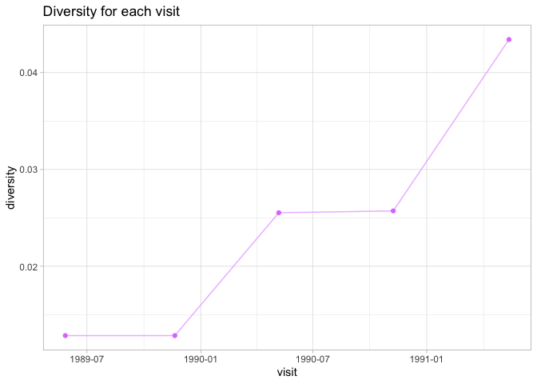
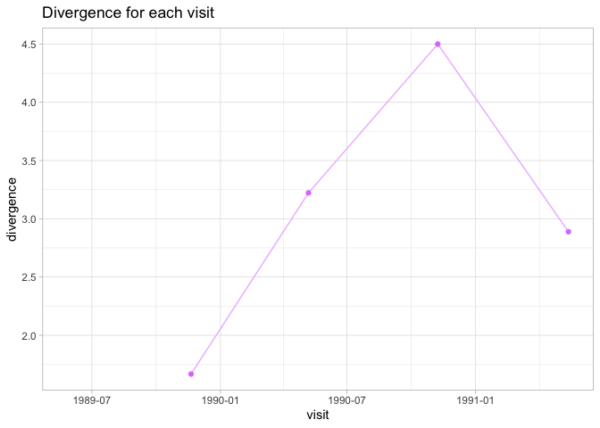
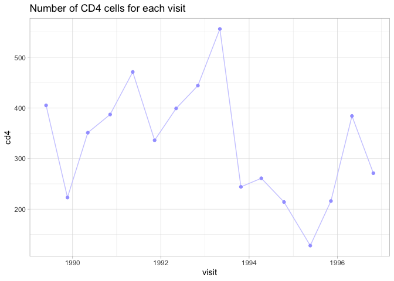
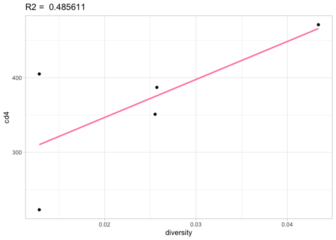
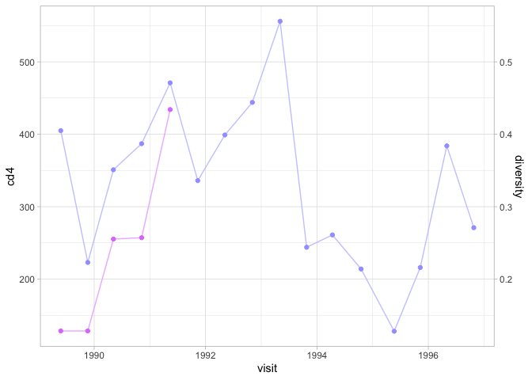
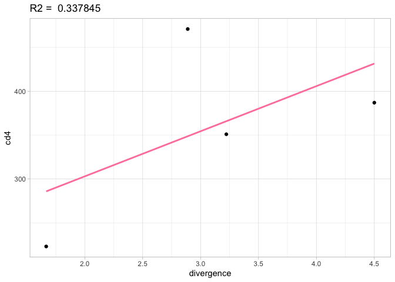
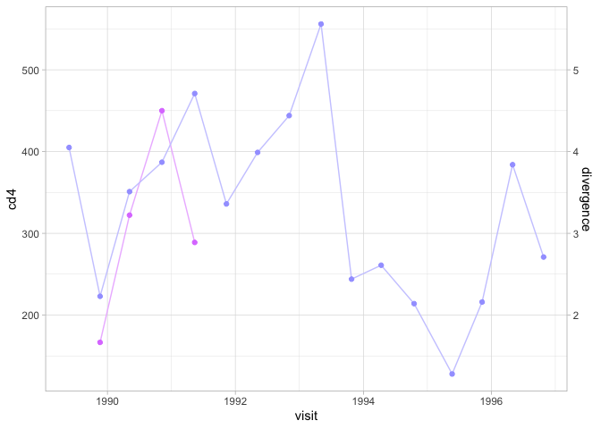

***

Pacient: 6
The Human Immunodeficiency Virus (HIV) is a retrovirus that destroys T helper CD4+ lymphocytes of the immune system. These types of lymphocytes are indispensable in the adaptive immune response: They participate in the activation of the immune response against different types of pathogens and produce different cytokines; they activate macrophages, induce inflammation and the production of IgG among other functions. When the CD4+ T lymphocyte count falls below 200 cells/mL, the patient is diagnosed with Acquired Immunodeficiency Syndrome (AIDS).

The activity of HIV in an infected patient can be regulated with antiviral drugs, in order to improve their quality of life and reduce the deterioration of the immune system. Therefore, according to these biological foundations, the hypothesis of the study is that in addition to diversity (genetic variety between the proviral DNA sequences of the same patient visit) and divergence (mutations accumulated in the clones over the patient visits) of HIV, the lower the levels of CD4+ T helper lymphocytes. So with the data from Markham et al we have analyzed the evolution of a patient's HIV.

***


```r
library(knitr)
library(Biostrings)
library(msa)
library(seqLogo)
library(ggplot2)
library(plotly)
library(scales)
library(ggpmisc)
```

# Visit nº 1

```r
v1 <- readDNAStringSet(file = "./hiv_sequences/s6v1.fasta") 
v1
```

```
## DNAStringSet object of length 3:
##     width seq                                               names               
## [1]   285 GAAGTAGTAATTAGATCCGCCAA...CAATAGTCTTTAATCAATCCTCA S6V1-1(7)
## [2]   285 GAAGTAGTAATTAGATCCGCCAA...CAATAGTCTTTAATCAATCCTCA S6V1-2(2)
## [3]   285 GAAGTAGTAATTAGATCCGCCAA...CAATAGTCTTTAATCAATCCTCA S6V1-3
```

## Consensus sequence

```r
subsM <- nucleotideSubstitutionMatrix(match = 2, mismatch = -3, baseOnly = TRUE) #Definition of the substitution matrix
m_align <- msa(v1, type="dna", substitutionMatrix = subsM, gapOpening = -2, gapExtension = -1, order="input")
```


```r
freq_abs <- consensusMatrix(m_align) 
freq_abs <- freq_abs[1:4,] #A, T, C, G frequences
(freq_rel <- prop.table(freq_abs,2)) 
```


```r
align <- makePWM(freq_rel)
consensus <- align@consensus
consensus
```

```
## [1] "GAAGTAGTAATTAGATCCGCCAATCTCACGGACAATGCTAAAATCATAATAGTGCATCAGAATGAATCTGTAGAAATGAATTGTACAAGACCCAACAACAATACAAGAAAAGGTATACATATAGGACCAGGCAGAGCATTTTATGCAACAGGAGAAATAATAGGAGATATAAGACAAGCACATTGTAACCTTAGTAGAGCACAATGGAATGACACATTTAAAAAGGATAGCTATAAAATTAAGAGAACAATTTAAGAATAAAACAATAGTCTTTAATCAATCCTCA"
```

## Diversity

a.	Multiple alignment

```r
attributes(align) 
```

b.	Bits in each position

```r
bits<-align@ic
```

c.	Diversity


```r
diversity_1 <- 2-mean(bits)
diversity_1
```

```
## [1] 0.0128433
```

# Visit nº 2 

```r
v2 <- readDNAStringSet(file = "./hiv_sequences/s6v2.fasta") 
v2
```

```
## DNAStringSet object of length 3:
##     width seq                                               names               
## [1]   285 GAAGTAGTAATTAGATCCGCCAA...CAATAGTCTTTAATCAATCCTCA S6V2-1(8)
## [2]   285 GAAGTAGTAATTAGATCCGCCAA...CAATAGTCTTTAATCAATCCTCA S6V2-2
## [3]   285 GAAGTAGTAATTAGATCCGCCAA...CAATAGTCTTTAATCAATCCTCA S6V2-3
```

## Diversity
To calculate the diversity "by hand" we calculate the absolute frequencies of the multiple alignment of all the sequences of this visit. Then we calculate the relative frequencies, and from these, the amount of information in each position (bits).
 

a.	Multiple alignment

```r
m_align_2 <- msa(v2, type="dna", substitutionMatrix = subsM, gapOpening = -2, gapExtension = -1, order="input")
```


```r
freq_abs_2 <- consensusMatrix(m_align_2) 
freq_abs_2 <- freq_abs_2[1:4,] 
(freq_rel_2 <- prop.table(freq_abs_2,2)) 
```

b.	Bits in each position

```r
x_2 <- ifelse(freq_rel_2>0, freq_rel_2 * log2(freq_rel_2), 0) 
bits_2 <- 2 + colSums(x_2)
```

c.	Diversity  

```r
diversity_2 <- 2-mean(bits_2)
diversity_2
```

```
## [1] 0.0128433
```

## Divergence
a.	Pairwise alignment

```r
subsM_pw<- nucleotideSubstitutionMatrix(match = 4, mismatch = -5, baseOnly = TRUE)
alignment_v2 = pairwiseAlignment(pattern=v2,subject = consensus,
                                           substitutionMatrix = subsM_pw,
                                           gapOpening = -2, 
                                           gapExtension= -1)
alignment_v2
```

```
## Global PairwiseAlignmentsSingleSubject (1 of 3)
## pattern: GAAGTAGTAATTAGATCCGCCAATCTCACGGACA...TAAGAATAAAACAATAGTCTTTAATCAATCCTCA
## subject: GAAGTAGTAATTAGATCCGCCAATCTCACGGACA...TAAGAATAAAACAATAGTCTTTAATCAATCCTCA
## score: 1128
```

b.	Nº of mutations (mismatch) of each sequence

```r
mutations_2 <- nmismatch(alignment_v2)
mutations_2
```

```
## [1] 1 2 2
```

c.	Mean of mutations

```r
m_mutations_2 <- mean(mutations_2)
round(m_mutations_2, digits=4)
```

```
## [1] 1.6667
```

```r
m_mutations_2
```

```
## [1] 1.666667
```

# Visit nº 3 

```r
v3 <- readDNAStringSet(file = "./hiv_sequences/s6v3.fasta") 
v3
```

```
## DNAStringSet object of length 9:
##     width seq                                               names               
## [1]   285 GAAGTAGTAATTAGATCCGTCAA...CAATAGTCTTTAATCAATCCTCA S6V3-1(3)
## [2]   285 GAAGTAGTAATTAGATCCGCCAA...CAATAGTCTTTAATCAATCCTCA S6V3-2
## [3]   285 GAAGTAGTAATTAGATCCGTCAA...CAATAGTCTTTAATCAATCCTCA S6V3-3
## [4]   285 GAAGTAGTAATTAGATCCGCCAA...CAATAGTCTTTAATCAATCCTCA S6V3-4
## [5]   285 GAAGTAGTAATTAGATCCGCCAA...CAATAGTCTTTAAGCAATCCTCA S6V3-5
## [6]   285 GAAGTAGTAATTAGATCCGTCAA...CAATAGTCTTTAATCAATCCTCA S6V3-6(3)
## [7]   285 GAAGTAGTAATTAGATCCGTCAA...CAATAGTCTTTAATCAATCCTCA S6V3-7
## [8]   285 GAAGTAGTAATTAGATCCGTCAA...CAATAGTCTTTAATCAATCCTCA S6V3-8
## [9]   285 GAAGTAGTAATTAGATCCGCCAA...CAATAGTCTTTAAGCAATCCTCA S6V3-9
```

## Diversity

a.	Multiple alignment

```r
m_align_3 <- msa(v3, type="dna", substitutionMatrix = subsM, gapOpening = -2, gapExtension = -1, order="input")
```


```r
freq_abs_3<-consensusMatrix(m_align_3) 
freq_abs_3<-freq_abs_3[1:4,] 
(freq_rel_3<-prop.table(freq_abs_3,2)) 
```

b.	Bits in each position

```r
x_3 <- ifelse(freq_rel_3>0, freq_rel_3 * log2(freq_rel_3), 0) 
bits_3 <- 2 + colSums(x_3)
```

c.	Diversity

```r
diversity_3 <- 2-mean(bits_3)
diversity_3
```

```
## [1] 0.02552871
```

## Divergence
a.	Pairwise alignment

```r
alignment_v3 = pairwiseAlignment(pattern=v3,subject = consensus,
                                           substitutionMatrix = subsM_pw,
                                           gapOpening = -2, 
                                           gapExtension= -1)
alignment_v3
```

```
## Global PairwiseAlignmentsSingleSubject (1 of 9)
## pattern: GAAGTAGTAATTAGATCCGTCAATCTCACAGACA...TAAGAATAAAACAATAGTCTTTAATCAATCCTCA
## subject: GAAGTAGTAATTAGATCCGCCAATCTCACGGACA...TAAGAATAAAACAATAGTCTTTAATCAATCCTCA
## score: 1093
```

b.	Nº of mutations (mismatch) of each sequence

```r
mutations_3 <- nmismatch(alignment_v3)
mutations_3
```

```
## [1] 4 1 4 2 2 3 6 4 3
```

c.	Mean of mutations

```r
m_mutations_3 <- mean(mutations_3)
m_mutations_3
```

```
## [1] 3.222222
```

# Visit nº 4 

```r
v4 <- readDNAStringSet(file = "./hiv_sequences/s6v4.fasta") 
v4
```

```
## DNAStringSet object of length 12:
##      width seq                                              names               
##  [1]   285 GATATAGTAATTAGATCCGCCAA...AATAGTCTTTAATCAATCCTCA S6V4-1
##  [2]   285 GATATAGTAATTAGATCCGCCAA...AATAGTCTTTAATCAATCCTCA S6V4-2(3)
##  [3]   285 GATATAGTAATTAGATCCGCCAA...AATAGTCTTTAATCAATCCTCA S6V4-3
##  [4]   285 GATATAGTAATTAGATCCGCCAA...AATAGTCTTTAATCAATCCTCA S6V4-4
##  [5]   285 GATATAGTAATTAGATCCGCCAA...AGTAGTCTTTAATCAATCCTCA S6V4-5
##  ...   ... ...
##  [8]   285 GATATAGTAATTAGATCCGCCAA...AATAGTCTTTAATCAATCCTCA S6V4-8
##  [9]   285 GATATAGTAATTAGATCCGCCAG...AATAGTCTTTAATCAATCCTCA S6V4-9
## [10]   285 GATATAGTAATTAGATCCGCCAA...AATAGTCTTTAATCAATCCTCA S6V4-10
## [11]   285 GATATAGTAATTAGATCCGCCAA...AATAGTCTTTAATCATTCCTCA S6V4-11
## [12]   285 GATATAGTAATTAGATCCGCCAA...AATAGTCTTTAATCATTCCTCA S6V4-12
```

## Diversity

a.	Multiple alignment

```r
m_align_4 <- msa(v4, type="dna", substitutionMatrix = subsM, gapOpening = -2, gapExtension = -1, order="input")
```


```r
freq_abs_4<-consensusMatrix(m_align_4) 
freq_abs_4<-freq_abs_4[1:4,]  
(freq_rel_4<-prop.table(freq_abs_4,2)) 
```

b.	Bits in each position

```r
x_4 <- ifelse(freq_rel_4>0, freq_rel_4 * log2(freq_rel_4), 0) 
bits_4<-2 + colSums(x_4)
```

c.	Diversity  

```r
diversity_4 <- 2-mean(bits_4)
diversity_4
```

```
## [1] 0.0257182
```

## Divergence
a.	Pairwise alignment

```r
alignment_v4 = pairwiseAlignment(pattern=v4,subject = consensus,
                                           substitutionMatrix = subsM_pw,
                                           gapOpening = -2, 
                                           gapExtension= -1)
alignment_v4
```

```
## Global PairwiseAlignmentsSingleSubject (1 of 12)
## pattern: GATA-TAGTAATTAGATCCGCCAATCTCACGGAC...TAAGAATAAAACAATAGTCTTTAATCAATCCTCA
## subject: GA-AGTAGTAATTAGATCCGCCAATCTCACGGAC...TAAGAATAAAACAATAGTCTTTAATCAATCCTCA
## score: 1082
```

b.	Nº of mutations (mismatch) of each sequence

```r
mutations_4 <- nmismatch(alignment_v4)
mutations_4
```

```
##  [1] 5 3 4 5 4 5 4 4 5 5 4 6
```

c.	Mean of mutations

```r
m_mutations_4 <- mean(mutations_4)
m_mutations_4
```

```
## [1] 4.5
```

# Visit nº 5 

```r
v5 <- readDNAStringSet(file = "./hiv_sequences/s6v5.fasta") 
v5
```

```
## DNAStringSet object of length 9:
##     width seq                                               names               
## [1]   285 GAAATAGTAATTAGATCCGCCAA...CAATAGTCTTTAATCAATCCTCA S6V5-1(2)
## [2]   285 GAAGTAGTAATTAGATCCGCCAA...CAATAGTCTTTAATCAATCCTCA S6V5-2
## [3]   285 GAAATAGTAATTAGATCCGCCAA...CAATAGTCTTTAATCAATCCTCA S6V5-3
## [4]   285 GAAGAAGTAATTAGATCCGCCAA...CAATAGTCTTTAATCAATCCTCA S6V5-4
## [5]   285 GAAGTAGTAATTAGATCCGCCAA...CAATAGTCTTTAATCAATCCTCA S6V5-5
## [6]   285 GAAGTAGTAATTAGATCCGCCAA...CAATAGTCTTTAATCAATCCTCA S6V5-6
## [7]   285 GAAGTAGTAATTAGATCCGCCAA...CAATAGCCTTTAATCAATCCTCA S6V5-7
## [8]   285 GAAATAGTAATTAGATCCGCCAA...CAATAGCCTTTAATCAATCCTCA S6V5-8
## [9]   285 GAAGTAGTAATTAGATCCGCCAA...CAATAGTCTTTAATCAATCCTCA S6V5-9
```


## Diversity

a.	Multiple alignment

```r
m_align_5 <- msa(v5, type="dna", substitutionMatrix = subsM, gapOpening = -2, gapExtension = -1, order="input")
```


```r
freq_abs_5<-consensusMatrix(m_align_5) 
freq_abs_5<-freq_abs_5[1:4,] 
(freq_rel_5<-prop.table(freq_abs_5,2))
```

b.	Bits in each position

```r
x_5 <- ifelse(freq_rel_5>0, freq_rel_5 * log2(freq_rel_5), 0) 
bits_5<-2 + colSums(x_5)
```

c.	Diversity  

```r
diversity_5 <- 2-mean(bits_5)
diversity_5
```

```
## [1] 0.04341283
```

## Divergence
a.	Pairwise alignment

```r
alignment_v5 = pairwiseAlignment(pattern=v5,subject = consensus,
                                           substitutionMatrix = subsM_pw,
                                           gapOpening = -2, 
                                           gapExtension= -1)
alignment_v5
```

```
## Global PairwiseAlignmentsSingleSubject (1 of 9)
## pattern: GAAATAGTAATTAGATCCGCCAATCTCACGGACA...TAAGAATAAAACAATAGTCTTTAATCAATCCTCA
## subject: GAAGTAGTAATTAGATCCGCCAATCTCACGGACA...TAAGAATAAAACAATAGTCTTTAATCAATCCTCA
## score: 1082
```

b.	Nº of mutations (mismatch) of each sequence

```r
mutations_5 <- nmismatch(alignment_v5)
mutations_5
```

```
## [1] 5 1 2 5 2 2 4 5 0
```

c.	Mean of mutations

```r
m_mutations_5 <- mean(mutations_5)
m_mutations_5
```

```
## [1] 2.888889
```


# Diversity between visits

```r
#DATA ORGANIZATION FOR GRAPHIC REPRESENTATIONS
df_cd4 <- data.frame('cd4' = c(405,223,351,387,471,336,399,444,
                              556,244,261,214,128,216,384,271),
                    'visit' = c('27/5/89','20/11/89','7/5/90','8/11/90',
                              '14/5/91','11/11/91','7/5/92','3/11/92',
                              '4/5/93','25/10/93','12/4/94','17/10/94',
                              '22/5/95','9/11/95','1/5/96','25/10/96'))
df_cd4$visit <- as.Date(df_cd4$visit, "%d/%m/%y")
df <- data.frame('diversity' = c(diversity_1, diversity_2, diversity_3, 
                              diversity_4, diversity_5),
               'divergence' = c(NA,m_mutations_2, m_mutations_3, 
                                  m_mutations_4, m_mutations_5),
               'visit' = df_cd4$visit[1:5],
               'cd4' = df_cd4$cd4[1:5])
```


```r
ggplot((data = df), aes(x=visit, y=diversity)) +
  geom_line(colour='#EDBCFF') +
  geom_point(colour='#DD81FF') +
  ggtitle("Diversity for each visit") +
  theme_light()
```

<!-- -->

# Divergence between visits

```r
ggplot((data = df),aes(x=visit, y=divergence)) +
  geom_line(colour='#EDBCFF') +
  geom_point(colour='#DD81FF') +
  scale_y_continuous(labels = label_number(accuracy = 0.1)) +
  ggtitle("Divergence for each visit") +
  theme_light()
```

```
## Warning: Removed 1 row containing missing values (`geom_line()`).
```

```
## Warning: Removed 1 rows containing missing values (`geom_point()`).
```

<!-- -->

# Nº of CD4 cells 

```r
ggplot((data = df_cd4),aes(x=visit, y=cd4)) +
  geom_line(colour='#CCCCFF') +
  geom_point(colour='#A3A3FF') +
  ggtitle("Number of CD4 cells for each visit") +
  theme_light()
```

<!-- -->

# Are CD4 levels dependent on diversity?

Is there any relationship between the evolution of the number of CD4 cells and diversity?

```r
model <- lm(cd4~diversity, data = df)
r2 <- summary(model)$r.squared
ggplot(df, aes(x=diversity, y=cd4)) +
  geom_point() +
  geom_smooth(method=lm , color="palevioletred1", se=FALSE) +
  labs(title = paste("R2 = ",signif(r2))) +
  theme_light()
```

```
## `geom_smooth()` using formula = 'y ~ x'
```

```r
ggplot() +
  geom_line(mapping = aes(x = df$visit, y = df$diversity*10000), colour='#EDBCFF') +
  geom_point(mapping = aes(x = df$visit, y = df$diversity*10000),colour='#DD81FF') +
  geom_line(mapping = aes(x = df_cd4$visit, y = df_cd4$cd4), colour='#CCCCFF') + 
  geom_point(mapping = aes(x = df_cd4$visit, y = df_cd4$cd4), colour='#A3A3FF') +
  scale_y_continuous(name = "cd4", sec.axis = sec_axis(trans = ~./1000, name = "diversity")) +
  xlab('visit') +
  theme_light()
```



Doing a linear regression and looking at the correlation between the diversity and the number of CD4 cells, the R2 gives 0.486. There is little correlation between the two variables: the more diversity between the sequences, the higher the T4 lymphocyte count. But this result is not very reliable as we are only using 5 data from the same patient for the regression. Looking at CD4+ lymphocyte levels and diversity across visits: CD4+ cell levels remain very low across visits but follow no overall trend. It seems that for this patient, there is no relationship between the two variables. But according to the disease and biological foundations we know that as diversity increases, CD4+ lymphocyte levels should decrease. All values ​​of all patients should be compared in order to reach a conclusion that is valid. The same will happen with the linear regression and plot over visits between divergence and CD4 cells.

# Are CD4 levels dependent on divergence?

Is there any relationship between the evolution of the number of CD4 cells and the divergence (number of mutations)?

```r
model <- lm(cd4~divergence, data = df)
r2 <- summary(model)$r.squared
ggplot(df, aes(x=divergence, y=cd4)) +
  geom_point() +
  geom_smooth(method=lm , color="palevioletred1", se=FALSE) +
  labs(title = paste("R2 = ",signif(r2))) +
  theme_light()
```

```
## `geom_smooth()` using formula = 'y ~ x'
```

```
## Warning: Removed 1 rows containing non-finite values (`stat_smooth()`).
```

```
## Warning: Removed 1 rows containing missing values (`geom_point()`).
```

```r
ggplot() +
  geom_line(mapping = aes(x = df$visit, y = df$divergence*100), colour='#EDBCFF') +
  geom_point(mapping = aes(x = df$visit, y = df$divergence*100),colour='#DD81FF') +
  geom_line(mapping = aes(x = df_cd4$visit, y = df_cd4$cd4), colour='#CCCCFF') + 
  geom_point(mapping = aes(x = df_cd4$visit, y = df_cd4$cd4), colour='#A3A3FF') +
  scale_y_continuous(name = "cd4", sec.axis = sec_axis(trans = ~./100, name = "divergence")) +
  xlab('visit') +
  theme_light()
```

```
## Warning: Removed 1 row containing missing values (`geom_line()`).
## Removed 1 rows containing missing values (`geom_point()`).
```



Doing a linear regression and looking at the correlation between the divergence and the number of CD4+ cells, the R2 gives 0.338. There is really low correlation between the two variables: the more divergence between the sequences, the higher the T4 lymphocyte count. Looking at CD4+ lymphocyte levels and divergence across visits: CD4+ cell levels remain very low across visits but do not follow any general trend. It seems that for this patient, there is no relationship between the two variables. But according to the disease and biological foundations we know that as the divergence increases, the levels of CD4+ lymphocytes should decrease.
