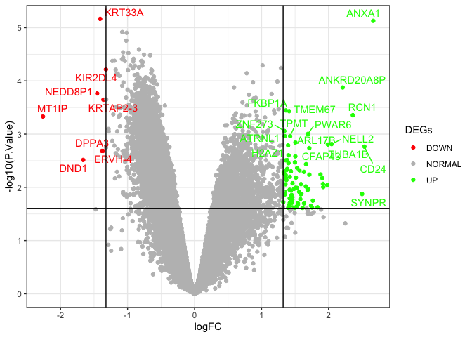

------------------------------------------------------------------------

# Question 1.

**How many GEO series of expression data are available related to "depressive disorder"? How many of them correspond to studies performed in humans?**

There's 4057 GEO series available related to "depressive disorder", and 3200 of them correspond to *Homo sapiens* data; in the database <https://www.ncbi.nlm.nih.gov/geo/>.

------------------------------------------------------------------------

# Question 2. Series GSE80245

## 

**Describe the experimental design, including the number of samples, replicates, and conditions.**

Series GSE80245 consists in a experimental design with *Homo sapiens* (Humans) as organism of study. The expression data it's from a neuron model of Alzheimer's disease; in which the groups are PS1P117L neurons with or without treatment of recombinant human mitochondrial transcriptional factor A (rhTFAM) protein. Each group with the conditions mentioned, has 3 replicates; so there's a total of 6 samples.

-   Samples:
    -   GSM2122631 PS1P117L cells, no rhTFAM, biological rep1
    -   GSM2122632 PS1P117L cells, no rhTFAM, biological rep2
    -   GSM2122633 PS1P117L cells, no rhTFAM, biological rep3
    -   GSM2122634 PS1P117L cells+rhTFAM, biological rep1
    -   GSM2122635 PS1P117L cells+rhTFAM, biological rep2
    -   GSM2122636 PS1P117L cells+rhTFAM, biological rep3

## 

**Identify the contrasts or comparisons of interest and create an experimental design and contrast matrix for this study in R. Print both objects.**

The contrast of interest in this study is between PS1P117L neurons treated with rhTFAM - PS1P117L neurons.


```r
#EXPERIMENTAL DESIGN
groups <- as.factor(c(rep("mutContr",3),rep("mutTreatm",3)))
experimental.design <- model.matrix(~0+groups)
rownames(experimental.design) <- c('C1', 'C2', 'C3', 'rhTFAM1', 'rhTFAM2', 'rhTFAM3')
colnames(experimental.design) <- gsub("groups","",colnames(experimental.design))
experimental.design
```

```
##         mutContr mutTreatm
## C1             1         0
## C2             1         0
## C3             1         0
## rhTFAM1        0         1
## rhTFAM2        0         1
## rhTFAM3        0         1
## attr(,"assign")
## [1] 1 1
## attr(,"contrasts")
## attr(,"contrasts")$groups
## [1] "contr.treatment"
```

```r
#CONTRAST MATRIX
contrast.matrix <- makeContrasts(mutTreatm-mutContr, levels=experimental.design)
contrast.matrix
```

```
##            Contrasts
## Levels      mutTreatm - mutContr
##   mutContr                    -1
##   mutTreatm                    1
```

## 

**Which microarray platform was used in this study?**

The Affymetrix human Gene 1.0 ST platform (GPL6244).

------------------------------------------------------------------------


# Question 3. Series GSE45483


```r
untar("./GSE45483_RAW.tar", exdir = getwd())
celfiles <- list.files(pattern = ".CEL", full = TRUE) # 6 samples
microarray.raw.data <- read.celfiles(celfiles)
```

```
## Platform design info loaded.
```

```
## Reading in : ./GSM1105432_MDA-MB-231_siCon_48h-A_HuEx-1_0-st-v2_.CEL.gz
## Reading in : ./GSM1105433_MDA-MB-231_siCon_48h-C_HuEx-1_0-st-v2_.CEL.gz
## Reading in : ./GSM1105434_MDA-MB-231_siCon_48h-D_HuEx-1_0-st-v2_.CEL.gz
## Reading in : ./GSM1105435_MDA-MB-231_siHMGA1_48h-A_HuEx-1_0-st-v2_.CEL.gz
## Reading in : ./GSM1105436_MDA-MB-231_siHMGA1_48h-C_HuEx-1_0-st-v2_.CEL.gz
## Reading in : ./GSM1105437_MDA-MB-231_siHMGA1_48h-D_HuEx-1_0-st-v2_.CEL.gz
```

```r
# we are going to name the samples manually
sampleNames(microarray.raw.data) <- c('siConA','siConC','siConD','shHMGA1A','shHMGA1C','shHMGA1D')
```


```r
#IMAGE ANALYSIS
image(microarray.raw.data[,1],col=rainbow(100))  
image(microarray.raw.data[,2],col=rainbow(100))
image(microarray.raw.data[,3],col=rainbow(100))
image(microarray.raw.data[,4],col=rainbow(100))
image(microarray.raw.data[,5],col=rainbow(100))
image(microarray.raw.data[,6],col=rainbow(100))
#There are no artefacts in the images.
```

## 

**Apply RMA normalization to the raw data. How many steps are there in RMA, and what is the objective of each step?**

1.  Background correction: The objective is to separate the signal detected by each probe and the signal of background noise.
2.  Quantile normalization: Probes signal are ranked by quantiles, substituted by the average and then log-transformed. The objective of this step is to remove array effects so measurements from different arrays are comparable.
3.  Tukey's Median polish (Summarization): The objective is to summarize into a single representative value a probe set. This is done by fitting a standard additive model.


```r
#RMA - NORMALIZATION
microarray.norm.data <- rma(microarray.raw.data, target = "core")
```

```
## Background correcting
## Normalizing
## Calculating Expression
```

## 

**Include boxplots before and after normalization. Are the samples comparable after normalization?**

Make the different samples comparable is one of the main objectives of performing the RMA normalization. Moreover, in the boxplots by samples before and after the RMA, we can see that normalized data of each sample have really similar means, more than before the analyses. So now different samples are comparable (and in the next section there's a density plot in which the normal distribution of data is observed).


```r
palette <- c('#FEF9E7','#FAE5D3','#FDEDEC','#E8DAEF','#D6EAF8','#D1F2EB')
#BOXPLOT BEFORE NORMALIZATION
boxplot(microarray.raw.data,las=3,cex.axis=0.5,target="core",col = palette, main = "Before RMA")

#BOXPLOT AFTER NORMALIZATION
boxplot(microarray.norm.data,las=3,cex.axis=0.5,col = palette, main="After RMA")
```


## 

**What is the overall objective of the normalization process in microarray analyses?**

The objective of Robust Multiarray Analyses for data normalization, is to remove experimental noise while conserving biological variability. It is also essential to be able to compare between the microarrays of the different samples.

For example, in this set of data we have gone from 6553600 to 22011 probes before and after the RMA. We can see in the density plot that all the normalized samples follow a normal distribution and have really similar means.


```r
dim(exprs(microarray.raw.data)) # 6553600
```

```
## [1] 6553600       6
```

```r
dim(exprs(microarray.norm.data)) # 22011
```

```
## [1] 22011     6
```

```r
hist(microarray.norm.data)
legend("topright",sampleNames(microarray.norm.data),fill = palette,cex=0.5)
```

<!-- -->

------------------------------------------------------------------------


# Question 4. Study GSE23290

**We will now analyze the study GSE23290 in detail, which we have been discussing during class. If we choose different thresholds for selecting DEGs (i.e., FC = 2.5 and adj P-value = 0.07)...**


```r
#LOADING THE DATA
load("./Normalized_microarray.RData")

#ANNOTATION
microarray.annot.data <- annotateEset(object =microarray.norm.data, x= huex10sttranscriptcluster.db, columns=c("PROBEID", "ENTREZID", "SYMBOL", "GENENAME","GO"))
```

```
## 'select()' returned 1:many mapping between keys and columns
## 'select()' returned 1:many mapping between keys and columns
## 'select()' returned 1:many mapping between keys and columns
## 'select()' returned 1:many mapping between keys and columns
```

```r
#EXPERIMENTAL MATRIX
groups <- as.factor(c(rep("Contr",5),rep("PD",5),rep("PDmut",3),"Contr_mut"))
experimental.design <- model.matrix(~0+groups)
rownames(experimental.design) <- sampleNames(microarray.norm.data)
colnames(experimental.design) <- gsub("groups","",colnames(experimental.design))
experimental.design
```

```
##      Contr Contr_mut PD PDmut
## C1       1         0  0     0
## C2       1         0  0     0
## C3       1         0  0     0
## C4       1         0  0     0
## C5       1         0  0     0
## IPD1     0         0  1     0
## IPD2     0         0  1     0
## IPD3     0         0  1     0
## IPD4     0         0  1     0
## IPD5     0         0  1     0
## MPD1     0         0  0     1
## MPD2     0         0  0     1
## MPD3     0         0  0     1
## MC       0         1  0     0
## attr(,"assign")
## [1] 1 1 1 1
## attr(,"contrasts")
## attr(,"contrasts")$groups
## [1] "contr.treatment"
```

```r
#CONTRAST MATRIX
contrast.matrix <- makeContrasts(PD-Contr,PDmut-Contr,Contr_mut-Contr,levels=experimental.design)
contrast.matrix
```

```
##            Contrasts
## Levels      PD - Contr PDmut - Contr Contr_mut - Contr
##   Contr             -1            -1                -1
##   Contr_mut          0             0                 1
##   PD                 1             0                 0
##   PDmut              0             1                 0
```

```r
#DEGs ANALYSIS
l.fit <- lmFit(microarray.annot.data,design=experimental.design)
c.l.fit <- contrasts.fit(l.fit,contrast.matrix)
fiteB <- eBayes(c.l.fit)
              
PD.Cont <- topTable(fiteB,coef=1,number=Inf,adjust.method="fdr",sort.by = "logFC") 

PD.Contclean <- PD.Cont[!is.na(PD.Cont$SYMBOL),]

#UP AND DOWN -REGULATED GENES
l.fc <- log2(2.5)

up.PD.Cont <- PD.Contclean[(PD.Contclean$adj.P.Val < 0.07) & (PD.Contclean$logFC > l.fc),]
down.PD.Cont <- PD.Contclean[(PD.Contclean$adj.P.Val < 0.07) & (PD.Contclean$logFC < -l.fc),]
```

## 

**How many DEGs do we obtain?**

In the differential gene expression analysis, we obtain 90 DEGs (Differentially Expressed Genes), 82 DEGs have upregulated expression levels and 8 DEGs have downregulated expression levels.


```r
PD.Contclean$DEGs <- "NORMAL"
PD.Contclean$DEGs[(PD.Contclean$adj.P.Val < 0.07) & (PD.Contclean$logFC > l.fc)] <- "UP"
PD.Contclean$DEGs[(PD.Contclean$adj.P.Val < 0.07) & (PD.Contclean$logFC < -l.fc)] <- "DOWN"
table(PD.Contclean$DEGs) # UP = 82; DOWN = 8
```

```
## 
##   DOWN NORMAL     UP 
##      8  17427     82
```

## 

**Create an updated volcano plot with these new thresholds and include it in the answer.**

In comparison with the volcano plot with FC = 2 and adj P-value = 0.05 thresholds for selecting DEGs: When using an FC of 2.5 and an adjusted p-value of 0.07; it results in more restrictive criteria because of the FC value, despite the p-value is less restrictive. That's why we have obtained much less DEGs when imposing these thresholds.


```r
#GENE IDs FOR UP- DOWN- REGULATED DEGs
PD.Contclean$namesdegs <- NA
PD.Contclean$namesdegs[PD.Contclean$DEGs != "NORMAL"] <- PD.Contclean$SYMBOL[PD.Contclean$DEGs != "NORMAL"]

#LARGEST UNADJUSTED P-VALUE - THESHOLD
th <- max(PD.Contclean[PD.Contclean$adj.P.Val < 0.07,"P.Value"])

#VOLCANO PLOT 
volcano <- ggplot(data=PD.Contclean, aes(x=logFC, y=-log10(P.Value), col=DEGs, label=namesdegs)) +
  geom_point() + 
  theme_bw() +
  geom_text_repel(show.legend=F,max.overlaps = 20) +
  scale_color_manual(values=c("red", "gray", "green")) +
  geom_vline(xintercept=c(-l.fc, l.fc), col="black") +
  geom_hline(yintercept=-log10(th), col="black")
volcano
```

<!-- -->

## 


```r
#DATA STOREMENT OF UP AND DOWN -REGULATED GENES
write.xlsx(up.PD.Cont,file="activated_genes_PDControl.xlsx",row.names = F)
write.xlsx(down.PD.Cont,file="supressed_genes_PDControl.xlsx",row.names = F)

#gene-enrichment analysis in the web http://geneontology.org/:
```

**Perform a gene-enrichment analysis on this list of DEGs. What is the top biological process enriched in the up-regulated genes (according to the fold enrichment)?**

The top-enriched biological process in the upregulated genes is the sperm flagellum assembly, with a fold enrichment of 25,44.

**Name 3 biological processes that may be worthy to investigate in more detail given the experimental design of the study and explain why.**

We know that some of the cases have Parkinson's disease due to a LRRK2 mutation. This causes an enrichment of calcium-mediated signaling and many other biological processes related to calcium. This is important as we want to investigate other processes not related to the LRRK2 mutation, as we want to know the genetic causes of ideopathic Parkinson's disease cases. In this study, IPD revealed an alteration of biological pathways related to long-term potentiation, so it would be interesting to study enriched biological processes related to these pathways, like:

1.  Memory (fold enrichment = 11.81)
2.  Regulation of neuronal synaptic plasticity (fold enrichment = 17.11)
3.  Signal transduction (fold enrichment = 1.87)

## 

**Is there any surprising biological process in the enrichment results? Can you provide a possible explanation for this unusual result?**

Sperm flagellum assembly is a surprising biological process in the enrichment results, as it seems to not be related to Parkinson's disease. But upregulated genes that are related to these pathways are also involved in protein localization and cell development processes, which are really important for neurological functions.

For example, the LRRK2 protein, which we know that is also involved in Parkinson's disease development, also participates in spermatogenesis-related biological processes.
